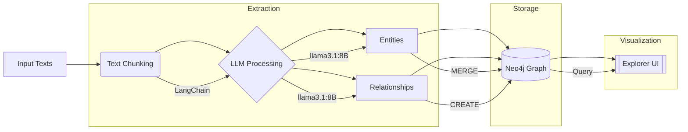

# Text to Neo4j Knowledge Graph Builder


A comprehensive Python solution that transforms unstructured text into a queryable knowledge graph using Ollama's LLM and Neo4j, with an interactive exploration interface.

## Features

- 📄 Batch processes multiple `.txt` files from an `Input` folder
- 🧠 Leverages Ollama's LLM (default: llama3.1:8B) for intelligent knowledge extraction
- 🗃️ Automated Neo4j graph construction with MERGE operations
- 🔄 Intelligent text chunking (512 chars with 50 overlap) via LangChain
- 🏷️ Automatic type normalization (e.g., "Chief Officer" → "ChiefOfficer")
- 🔗 Relationship standardization (UPPER_SNAKE_CASE)
- 🔍 Built-in NLP explorer with semantic search capabilities
- 📊 Interactive graph visualization and statistics

## Project Structure

```
Text-to-Neo4j-Knowledge-Graph-Builder/
├── Text_to_Neo4J.py               # Main ETL pipeline
├── Neo4j_Data_Retrival_NLP.py      # Interactive explorer
├── Input/                          # Source text files
│   ├── sample1.txt
│   └── sample2.txt
├── requirements.txt                # Dependency spec
├── LICENSE                         # MIT License
└── README.md                       # This document
```

## Prerequisites

| Component       | Version       | Installation Guide                 |
|-----------------|---------------|------------------------------------|
| Python          | 3.8+          | [python.org](https://www.python.org/downloads/) |
| Neo4j           | 4.4+          | [neo4j.com/download](https://neo4j.com/download/) |
| Ollama          | Latest        | [ollama.ai](https://ollama.ai/)    |
| llama3.1:8B     | -             | `ollama pull llama3.1:8B`          |

## Installation

1. **Clone repository**:
   ```bash
   git clone https://github.com/Mrigank005/Text-to-Neo4j-Knowledge-Graph-Builder.git
   cd Text-to-Neo4j-Knowledge-Graph-Builder
   ```

2. **Set up environment**:
   ```bash
   pip install -r requirements.txt
   python -m spacy download en_core_web_sm
   ```

3. **Configure Neo4j**:
   - Start Neo4j Desktop/Server
   - Set password in both scripts:
     ```python
     NEO4J_PASSWORD = "your_neo4j_password"  # In both .py files
     ```

4. **Prepare Ollama**:
   ```bash
   ollama serve &  # Run in background
   ollama pull llama3.1:8B
   ```

## Workflow Overview



## Usage

### 1. Data Ingestion
```bash
python Text_to_Neo4J.py
```
- Processes all `.txt` files in `Input/`
- Shows real-time progress for each chunk
- Outputs summary statistics

### 2. Graph Exploration
```bash
python Neo4j_Data_Retrival_NLP.py
```
**Menu Options**:
1. 📊 Graph summary statistics
2. 🔍 Node search (exact/NLP)
3. 🕵️ Node detail inspection
4. 🛣️ Pathfinding between nodes
5. 🔄 Duplicate relationship check
6. 🧠 Semantic search

## Example Use Case

**Input Text**:
```
Apple Inc. was founded by Steve Jobs in 1976. The company develops consumer electronics like the iPhone.
```

**Resulting Graph**:
```cypher
(:Company {id: "Apple Inc.", name: "Apple Inc."})-[:FOUNDED_BY]->(:Person {id: "Steve Jobs"})
(:Company {id: "Apple Inc."})-[:DEVELOPS]->(:Product {id: "iPhone"})
```

## Configuration Reference

| Parameter           | Default Value               | Description                          |
|---------------------|-----------------------------|--------------------------------------|
| `NEO4J_URI`         | `bolt://localhost:7687`     | Neo4j connection endpoint            |
| `OLLAMA_MODEL`      | `"llama3.1:8B"`            | LLM model for extraction             |
| `chunk_size`        | `512`                       | Character count per text segment     |
| `chunk_overlap`     | `50`                        | Overlap between segments             |

## Troubleshooting Guide

| Issue                          | Solution Steps                     |
|--------------------------------|------------------------------------|
| Neo4j connection failed        | 1. Verify service is running<br>2. Check bolt:// URL<br>3. Confirm credentials |
| No files processed             | 1. Ensure `Input/` directory exists<br>2. Verify .txt extension |
| LLM timeout errors             | 1. Check `ollama serve` status<br>2. Reduce chunk_size<br>3. Try simpler model |
| Duplicate nodes/relationships  | 1. Pre-clear graph if needed<br>2. Check MERGE logic |

## Performance Tips

- For large datasets:
  - Increase chunk_size to 768-1024
  - Use `ollama pull llama3:70B` for complex texts
  - Process files sequentially with pauses

- For better accuracy:
  - Pre-process texts to remove noise
  - Add domain-specific examples in prompts
  - Use smaller chunk_overlap (20-30)

## License

MIT License - See [LICENSE](LICENSE) for full text.

---
